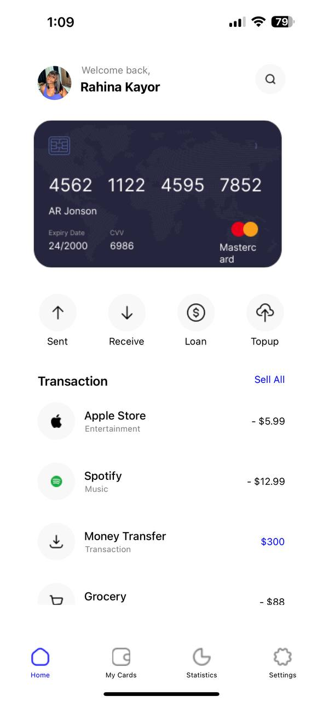

Description
This is a React Native finance application designed to help users manage their financial transactions effectively. The app features a home screen displaying transaction history, a settings screen for personal preferences, and additional screens for managing cards and viewing statistics. The application also supports both light and dark themes, with dynamic icon and text color changes based on the theme.

Features
Home Screen: Displays a welcome message, user profile, a summary of recent transactions, and quick action buttons for sending, receiving, loaning, and topping up money.

My Cards Screen: Manage your saved cards.

Statistics Screen: View financial statistics 

The settings screen allows users to toggle between light and dark modes. The theme toggle affects the entire application, including text colors, background colors, and icon tinting.

SCREENSHOTS

